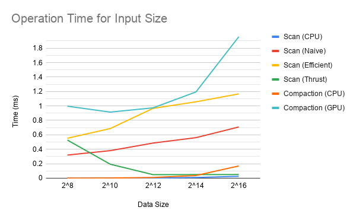

CUDA Stream Compaction
======================

**University of Pennsylvania, CIS 565: GPU Programming and Architecture, Project 2**

* Taylor Nelms
  * [LinkedIn](https://www.linkedin.com/in/taylor-k-7b2110191/), [twitter](https://twitter.com/nelms_taylor), etc.
* Tested on: Windows 10, Intel i3 Coffee Lake 4-core 3.6GHz processor, 16GB RAM, NVidia GeForce GTX1650 4GB

### Relevant picture

You must forgive me, I have no fancy picture to demonstrate performance metrics; in another world where this project had no machine learning element, I'm sure I would have come up with something quite special.

### Design Decisions

I decided to bundle the `upsweep` threads in such a fashion that adjacent threads would be doing work as we went up the levels of the tree, allowing later threads to quit early. An area of future development would be to only spawn the necessary number of threads, but I didn't quite get there.

For the `downsweep` function, I made no such optimizations, due to time constraints and a desire to get the right answer over a more complex answer.

### Performance Anaylsis

All tests performed with a `BLOCKSIZE` of 256.
A quick run through on some different input sizes yielded the following performance results:



Notably, every one my implementations was suboptimal. The real kicker was the "work-efficient" parallel scan. Here, I think the issue is that I did not vary the number of threads being spun up at each level; as such, many blocks were created to do a minimal amount of work, or no work at all. By fixing this, I'm sure I could take the performance penalties down significantly.

The time for the `thrust` scan is the strangest of them all, appearing to take less time as the input number increased. I have no reasonable explanation for this; it is possible that my testing environment was not clean/precise enough to get a good measurement of each implementation. In fact, multiple runs of the same input sizes yield wild variations in run time, so I would wager much of the trends on the graph can be attributed, in some part, to noise.

Notably, the `thrust` implementation is also slower than the CPU approach. This tells me that:

* Even for `2^16` inputs, the memory overhead of putting all the data onto the GPU, and then taking it off the GPU, is the primary limiting factor
* It takes a significant amount of data for a GPU approach to function better than a CPU approach

By a similar token, I would wager that the performance failings of my implementations came primarily from treating both thread generation overhead and global memory accesses as "free," when they, in fact, have a significant impact on overall performance.

### Limitations

Testing size currently limited to data up to size `2^16`. The scan's upsweep and downsweep start to break above that. I'm not entirely sure why, but I suspect it relates to either GPU maximums or some silly thing I did where I put an int somewhere that a long should be. I am, unfortunately, out of time to determine why this is the case.

### Raw Output

Here is the output for one run of the various algorithms, with an input size of `2^16`:

```
****************
** SCAN TESTS **
****************
    [  36   5  17  26  47  15   8  41  14   4  31  34  39 ...  12   0 ]
==== cpu scan, power-of-two ====
   elapsed time: 0.032ms    (std::chrono Measured)
    [   0  36  41  58  84 131 146 154 195 209 213 244 278 ... 1603052 1603064 ]
==== cpu scan, non-power-of-two ====
   elapsed time: 0.0276ms    (std::chrono Measured)
    [   0  36  41  58  84 131 146 154 195 209 213 244 278 ... 1603003 1603018 ]
    passed
==== naive scan, power-of-two ====
   elapsed time: 0.729088ms    (CUDA Measured)
    [   0  36  41  58  84 131 146 154 195 209 213 244 278 ... 1603052 1603064 ]
    passed
==== naive scan, non-power-of-two ====
   elapsed time: 0.674208ms    (CUDA Measured)
    [   0  36  41  58  84 131 146 154 195 209 213 244 278 ...   0   0 ]
    passed
==== work-efficient scan, power-of-two ====
   elapsed time: 1.22502ms    (CUDA Measured)
    passed
==== work-efficient scan, non-power-of-two ====
   elapsed time: 1.90038ms    (CUDA Measured)
    passed
==== thrust scan, power-of-two ====
   elapsed time: 0.079104ms    (CUDA Measured)
    passed
==== thrust scan, non-power-of-two ====
   elapsed time: 0.059392ms    (CUDA Measured)
    passed

*****************************
** STREAM COMPACTION TESTS **
*****************************
    [   2   1   3   2   1   3   0   3   2   2   1   2   3 ...   0   0 ]
==== cpu compact without scan, power-of-two ====
   elapsed time: 0.2995ms    (std::chrono Measured)
    [   2   1   3   2   1   3   3   2   2   1   2   3   3 ...   3   1 ]
    passed
==== cpu compact without scan, non-power-of-two ====
   elapsed time: 0.1916ms    (std::chrono Measured)
    [   2   1   3   2   1   3   3   2   2   1   2   3   3 ...   3   3 ]
    passed
==== cpu compact with scan ====
   elapsed time: 0.5754ms    (std::chrono Measured)
    [   2   1   3   2   1   3   3   2   2   1   2   3   3 ...   3   1 ]
    passed
==== work-efficient compact, power-of-two ====
   elapsed time: 2.04045ms    (CUDA Measured)
    [   2   1   3   2   1   3   3   2   2   1   2   3   3 ...   3   1 ]
    passed
==== work-efficient compact, non-power-of-two ====
   elapsed time: 1.34554ms    (CUDA Measured)
    [   2   1   3   2   1   3   3   2   2   1   2   3   3 ...   3   3 ]
    passed
```
