CUDA AES Encryption
===================

**University of Pennsylvania, CIS 565: GPU Programming and Architecture, Project 4**

* Taylor Nelms
  * [LinkedIn](https://www.linkedin.com/in/taylor-k-7b2110191/), [twitter](https://twitter.com/nelms_taylor)
* Tested on: Windows 10, Intel i3 Coffee Lake 4-core 3.6GHz processor, 16GB RAM, NVidia GeForce GTX1650 4GB

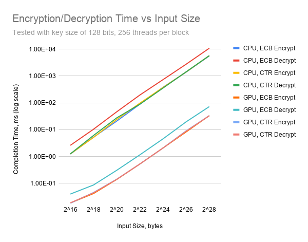

## Motivation

Encryption is a pervasive element of cybersecurity; however, despite needing to encrypt vast amounts of data, there is a relative lack of parallelizable options to do so. Some of that is algorithmic in nature; various encryption algorithms are data-dependent in an unbroken chain from the first bit to the last. However, there are algorithms that allow for a data-parallel approach to encryption; in particular, the ECB and CTR encryption modes of the AES algorithm allow for such an operation.

This project will endeavor to optimize a parallel approach to AES encryption on the GPU via the CUDA programming frameworks. I will attempt to tweak any and all configuration parameters and memory access patterns to allow for highly efficient encryption/decryption leveraging the GPU's capabilities.

## The AES Algorithm

The **Advanced Encryption Standard**, or **AES**, is an encryption algorithm adopted by NIST in 2001. It was developed, and subsequently adopted, to fill holes and vulnerabilities in the Data Encryption Standard (which dated back to 1977).

It is a **block cipher** that operates with a symmetric key. This means that it operates on fixed-length blocks of data; in this case, **16-byte** blocks. The idea behind symmetric-key encryption is that a single key is used to both encrypt and decrypt the data; this is in contrast to an algorithm like RSA, which uses two related, asymmetric keys (containing both a public and private component) to encrypt data between two parties.

The AES standard is defined for key lengths of **128**, **192**, and **256-bit** key sizes (16, 24, and 32 bytes). A well-used AES with a 128-bit key is considered effectively unbreakable via brute force methods; the larger key sizes are even more so.

### AES Modes

There are a few different ways to implement a block cipher like AES. The algorithm itself only applies to a single block of plaintext and how it combines with a key to produce the ciphertext; for larger data, we can approach the encryption in different fashions.

#### ECB

The easiest mode is **Electronic Codebook**, or **ECB**. This simply encrypts each block of plaintext using the same key in the same manner, and appends the results together.

This method is naively parallelizable, as the same operation is applied to each block of plaintext; it is one of the modes implemented in this project.

This has the disadvantage that, for repeated plaintext data, the ciphertext will be similarly repeated. As such, even though retrieving the exact plaintext may be impossible, the structure of the plaintext data may still be visible.

<figure class="image">
  
  <figcaption>Original Content</figcaption>
</figure>
<figure class="image">
  
  <figcaption>Encrypted using ECB</figcaption>
</figure>
<figure class="image">
  
  <figcaption>Encrypted using CTR</figcaption>
</figure>

#### CTR

**Counter** mode, or **CTR**, takes a different approach. It requires an **Initialization Vector**, or **IV**, along with the key and plantext to operate. This IV is the same size as the block length (16 bytes). This IV is encrypted with the key, and then **XOR**'d with the first block of plaintext to produce the first block of ciphertext. The IV is then incremented for the next block, and the process repeats.

Notably, this means that for any IV, we can determine what the IV will be at a given block in the ciphertext. As such, we can easily parallelize this approach, with each kernel operating on what it knows the IV will be at its location.

It is important when using this mode to not re-use the same IV with any key. Every combination of key and IV will create a unique string of data, which, when **XOR**'d with a string of plaintext, produces the ciphertext. This can lead to information leaks, where, if you know both the ciphertext and plaintext for a given key-iv pair, you can then produce the encryption string for that pair with a simple xor operation.

One slight advantage of this approach, though, is that encryption and decryption use the same operation, as each simply construct the encryption-string and xor the plaintext/ciphertext with it.

#### CBC

**Cipher Block Chaining**, or **CBC** mode, is considered slightly more secure than CTR. Instead of simply incrementing a previous block's **IV** to get the IV for the next block, it operates by **XOR**ing the plaintext with the first IV, encrypting that, and then using the resulting ciphertext as the IV for the next step.

This has the advantage that each block of ciphertext is dependent on the plaintext for that block, the key, the initial IV, and every block of plaintext that came before it.

Unfortunately for us, this means it is impossible to data-parallelize, and it is not considered in this GPU implementation.

### Padding

For data that does not fit within the block size, data ends up padded to meet the block size requirements. For my implementation, I used [PKCS#7](https://en.wikipedia.org/wiki/Padding_(cryptography)#PKCS#5_and_PKCS#7) padding (though other methods could be used); in brief, this involves figuring out how many bytes short of a block the data is, and adding bytes containing that value to the end until it is full. (If we are already at a block boundary, an extra block is added.)

For example, if our data contained a final partial block with only four bytes in it, we would pad the remaining 12 (`0x0C`) to the end in the following manner: "0xXX 0xYY 0xZZ 0xWW **0x0C 0x0C 0x0C 0x0C 0x0C 0x0C 0x0C 0x0C 0x0C 0x0C 0x0C 0x0C**".

### The Algorithm

#### Rounds

The AES algorithm does a set of operations to the plaintext across a number of rounds. Each size key uses a different number of rounds: `10` rounds for `128`-bit keys, `12` rounds for `192`-bit keys, and `14` rounds for `256`-bit keys. This number of rounds roughly correlates to the amount of computational work done overall; below, we see the encryption/decryption time for different key lengths on a CPU.

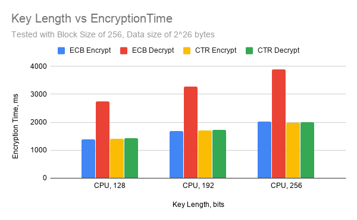

The algorithm is applied in series to a working state of the plaintext block; each step (summarized below) operates on the block in-place. This working state is traditionally treated as a column-major `4x4` byte matrix.

#### Steps

Each round does four main steps (with some differences across the final round): **Substitute Bytes**, **Shift Rows**, **Mix Columns**, and **Add Key**.

##### Substitute Bytes

Each byte is substituted for a different value. This is most easily done via a 256-entry lookup table. (The inverse of this step is done using the inverse of this table.) These are referred to for my implementation as the **S-box** and **RS-box**, respectively. Given how many lookups are done in this table, the issue of where we store it is an important performance consideration.

##### Shift Rows

While remembering that the state is in a column-major matrix, the issue of shifting rows becomes slightly less memory-trivial. Nevertheless, this step is simply a matter of rotating each matrix row to the left some number of times; `0` times for the first row, `1` for the second, `2` for the third, and `3` for the final row. The inverse operation is the same, but in the opposite direction.

##### Mix Columns

One of the more mathematically complex steps, this produces each byte of column output as a combination of each other byte in the column. It uses something tantalizingly close to matrix multiplication, but is unfortunately closer to matrix multiplication using finite-field arithmetic, which limited my ability to make use of CUDA primitives to expedite the process.

##### Add Key

The key itself is, at the beginning of the algorithm, transformed into a key schedule (the **RoundKey** in my implementation, which is relevant in the same way the **S-box** is). Depending on which round we are in, we simply **XOR** the state with the key schedule at a particular point.

Since the expanded key is between `176` and `240` bytes long (depending on our key size), and is used multiple times and by all blocks in the same way, the method by which we store and reference it is an important consideration to this project.

##### Further Reading

For a more in-depth discussion about the structure of the algorithm, I highly recommend [this pdf from Purdue](https://engineering.purdue.edu/kak/compsec/NewLectures/Lecture8.pdf), which proved useful when implementing this project.

## My Implementation

### Basic Approach

Though it may have been technically feasible to parallelize or pipeline dataflow within the encryption of each block, I instead elected to perform the encryption of each block using a single kernel thread; that way, I could eliminate data dependencies between threads, and (ideally) each warp could simultaneously operate on 32 blocks without interruption.

I allow for one thread to encrypt/decrypt multiple AES blocks as well, to see if there is any advantage to reducing the thread count overall and instead have each thread do more work.

#### Memory

The input and output buffers are, of course, very large, and each thread will need to access a different part of them. As such, global memory seems the reasonable place to keep them.

However, there are a few pieces of data that are constant to each thread. One are the tables for byte substitution, **sbox** and **rsbox**. Another is the key schedule itself, **roundkey**; it is precomputed on the CPU, but then used by each kernel without being modified at all.

As such, we have a few options of how to put these chunks of data (containing up to `752` total bytes) somewhere that each thread can access them.

* Access each table from global memory
* Put each table into global constant memory
* Pull the contents of the tables into shared memory
    * Implementation allows for putting the key, the substitution boxes, or both into shared memory
* Wrap the tables into a struct and pass them directly to each kernel via a parameter to the `__global__ void` function

#### CUDA Block Size

As we know, each CUDA block can contain a different number of threads. I allow for dynamically configurable block sizes, and can thereby analyze the performance impacts thereof.

### Optimizations

#### Vector Bitwise Operations

For the step of adding the round key to the current state, I was stymied by the lack of vector bitwise operations. I allowed for treating the state as both a set of four `uchar4` structs, or as an array of four `uint8_t[4]` arrays, but was unable to get any performance benefit out of it.

However, for a step as easy as bitwise-xor'ing a whole block of data, it turns out that there was still improvement to be made.

For the encrypt step, this is the code I started with for the `addKey` operation:

```C
__device__ void addKey(State* state, const uint8_t* roundKey, uint8_t roundNum) {

  for (uint8_t i = 0; i < 4; i++) {
    unsigned rkbase = (roundNum * Nb * 4) + (i * Nb);
    
    state->data[i].x ^= roundKey[rkbase + 0];
    state->data[i].y ^= roundKey[rkbase + 1];
    state->data[i].z ^= roundKey[rkbase + 2];
    state->data[i].w ^= roundKey[rkbase + 3];
  }
}
```

This is the performance profile I got from it:

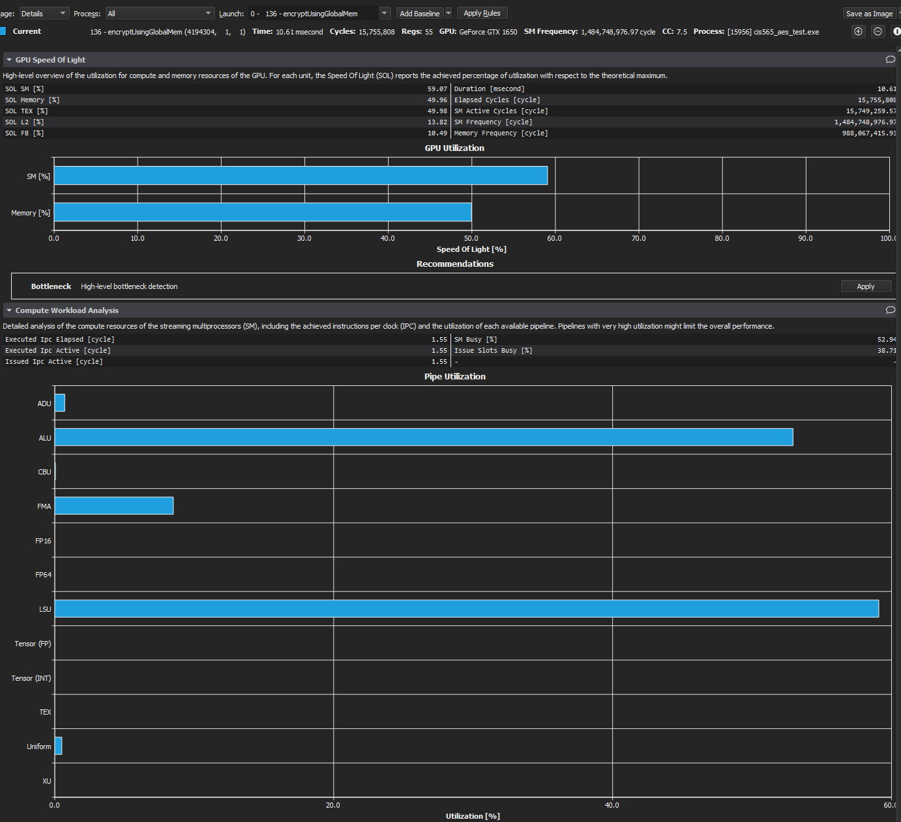

But in investigating the compiled code, I noticed that loads were happening one byte at a time for the `xor` operation. I changed the code to the following:

```C
__device__ void addKey(State* state, const uint8_t* roundKey, uint8_t roundNum) {

  for (uint8_t i = 0; i < 4; i++) {
    unsigned rkbase = (roundNum * Nb * 4) + (i * Nb);
    
    *reinterpret_cast<uint32_t*>(&state->data[i]) = 
      *reinterpret_cast<uint32_t*>(&state->data[i]) ^
      *reinterpret_cast<const uint32_t*>(&roundKey[rkbase]);
  }
}
```

This was the resulting performance profile:

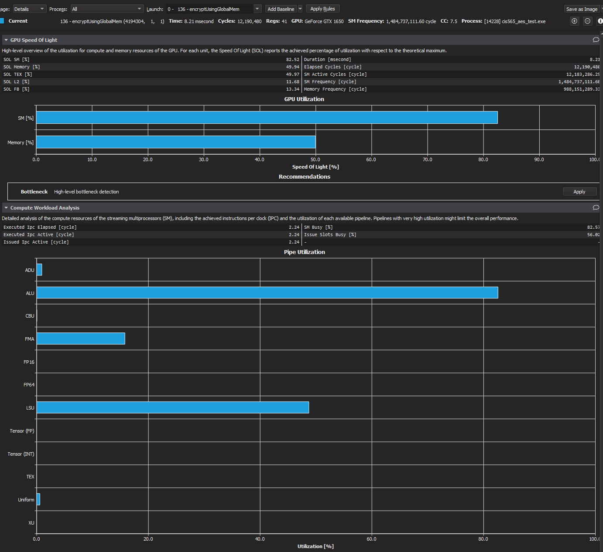

The encryption operation as a whole saw a nearly 20% speedup from that change alone, which is extremely significant. Furthermore, the usage of the compute capability of the CPU drastically increased. While the other steps may not have had as many efficient changes, this one was particularly striking in just how well it cut down on operation time.

#### Removing Function Calls

When looking at the source code in the profile for the Debug build, I saw that each call to my fixed-field arithmetic primitives was using a lot of memory just for the function calling. This was related to how I was implementing my multiplication: I was doing so as a single entry function that then directed the value towards the correct operand. Replacing that seems to have "inlined" both operations.

```C
__host__ __device__  uint8_t gfmult2(uint8_t x) {
  uint8_t result = (x >> 7) ? (x << 1) ^ GF_MAGIC : (x << 1);
  return result;
}

__host__ __device__  uint8_t gfmult3(uint8_t x) {
  uint8_t result = ((x >> 7) ? (x << 1) ^ GF_MAGIC : (x << 1)) ^ x;
  //uint8_t result = gfmult2(x) ^ x;
  return result;
}
```

What I end up with are two primitives that I can then use to significantly improve the encryption step of the process, and even simplify portions of the decryption steps. Considering that most of the extra computational complexity of the decryption comes from the more heavy-duty `Mix Columns` step, and that that complexity comes with an occasionally `2x` performance time impact, every little bit on this innermost loop helps.

In the `Debug` configuration, this cut the overall time in half(!). This is indicative of just how much operation was happening inside the `Mix Columns` step.

It's hard to tell if the same can be said in `Release` mode; I suspect it's already taken care of. Nonetheless, it seemed a worthy improvement to make, at least somewhat for the sake of readability.

## Performance Analysis

### Vs Baseline


We see from this chart that, for data ranges between roughly `250KB` and `250MB`, we acheive a nearly 150-times speedup for our GPU implementation over a CPU implementation, just using global memory for our constant tables and expanded key.

The other interesting thing here is that, for these input sizes, performance scales pretty well linearly (note the logarithmic axes for both `x` and `y`). This is a good sign that we are looking at input sizes that are able to hide the CUDA overhead for launching our execution kernels, which bodes well for further analysis.

However, we have identified a number of tunable parameters that we can use to adjust performance time for GPU operations; as such, further analysis will consider GPU implementations against each other, rather than compared to the CPU implementations.

##### Why the longer time for ECB decryption?

It is worth noting, before we go further, that while ECB encryption, CTR encryption, and CTR decryption all have functionally identical execution times, the same cannot be said for ECB decryption, which often runs close to twice as long. Why is that? Most of the encryption/decryption steps are nearly identical and very symmetric; however, the **Mix Columns** step contains a huge computational load for decryption that did not exist for encryption.

Let's see what that looks like in the profiler:

###### Encryption

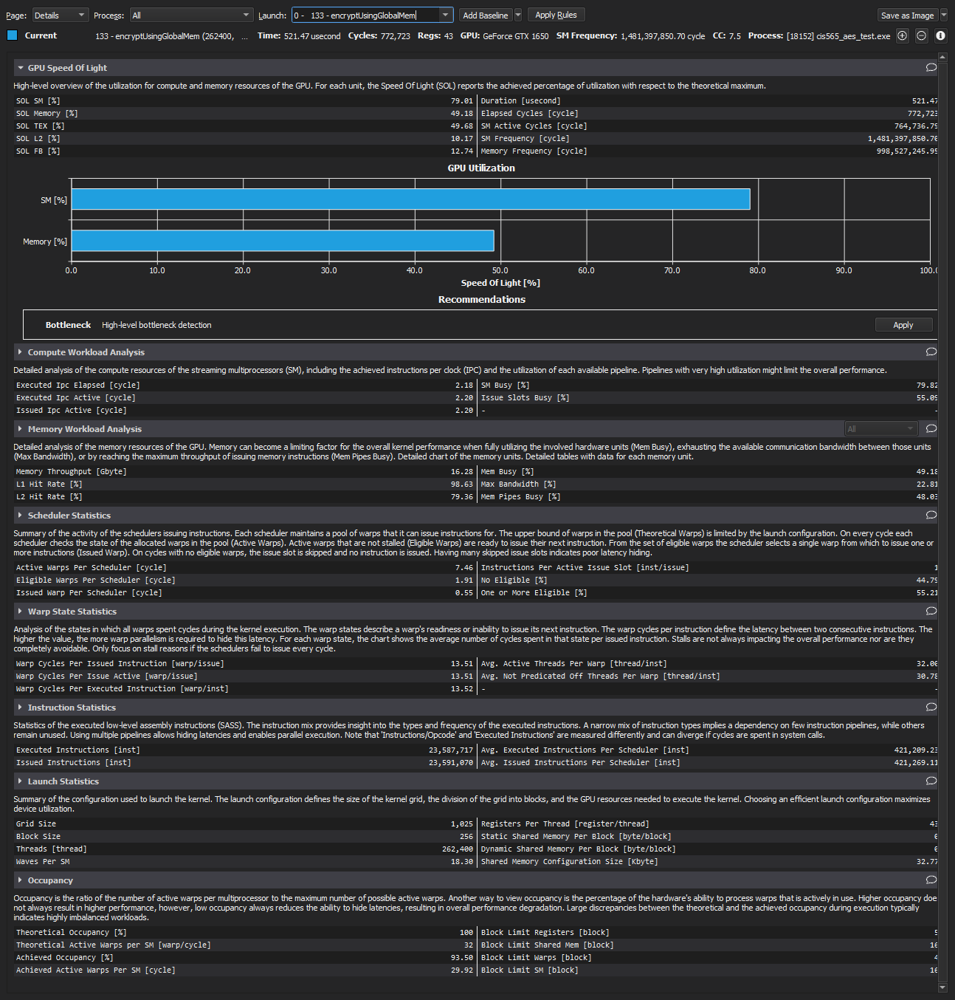

###### Decryption

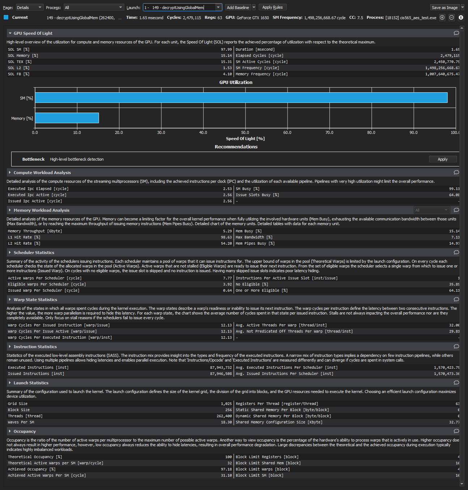

TODO: explain the difference, and show the Speed of Light graph that points to it as well.

### Memory Modes

With a few modes by which we accessed the memory for the `RoundKey` and `SBox` variables, let us look at the performance impacts of our decisions:

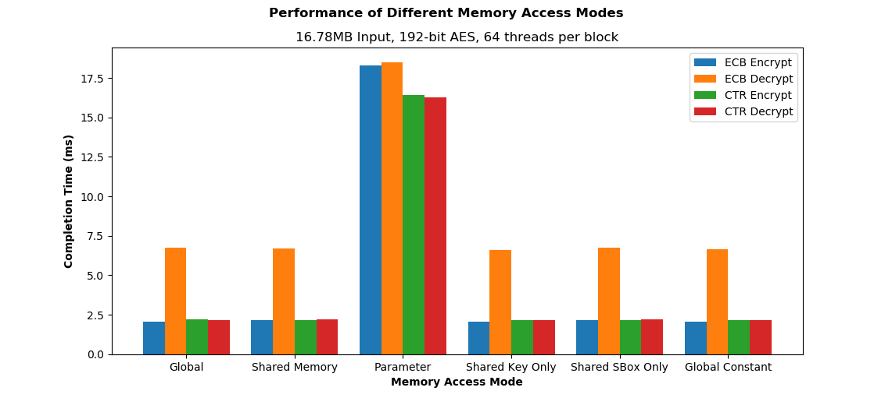

So, the elephant in the room is that passing the `SBox` and `RoundKey` variables to the global kernel calls as parameters is a **terrible** idea.

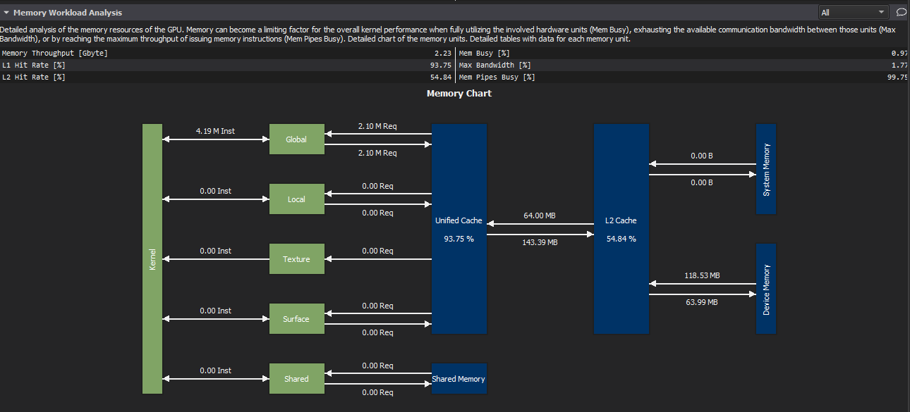

Here, we see a lot more calls to device memory than the other profiles (shown in the section below), and a lot more instances where the memory pipes are busy, and/or the L2 cache ends up missing. This relates to how much data we're putting on each kernel; if each one is treating this struct full of some 752 bytes as a potentially separate variable, it stands to reason that we're putting a lot of redundant memory load onto the system. Even if it is accessed the same by threads and warps within a block, switching blocks out may still mean swapping that data on each context switch.

So let's look at the previous chart without that pesky outlier:

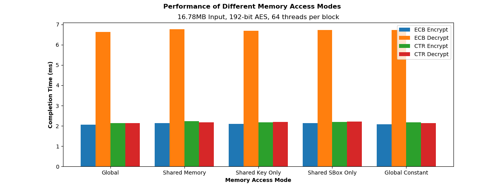

Looking a little more closely at our different modes of accessing memory, we see the striking results of... no meaningful difference at all.

What could cause this? Certainly, the distinctions between global memory, constant memory, and shared memory should have some kind of performance implication, right?

We can look into the profile tools to try and figure out the causes behind this anomaly:

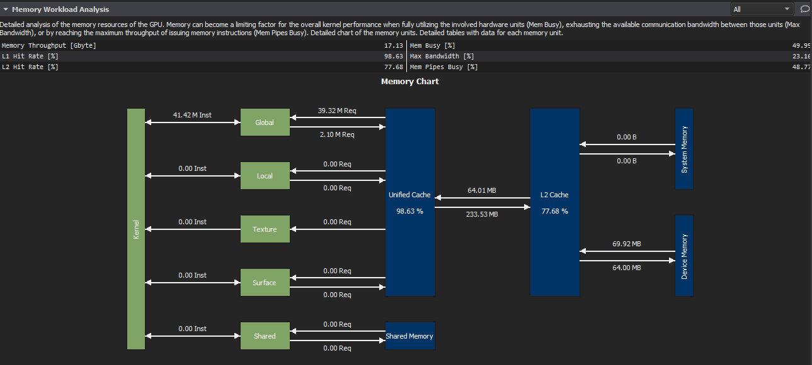


The first thing we see is that the Constant and Global memory accesses are functionally identical; the little variation shown can be explained away as noise. The next thing to note is that the primary difference in where memory requests are happening are in relation to whether we're pulling global memory from the Unified Cache (in the Global and Constant cases), or from Shared Memory (in the Shared case); most every access upstream from there looks the same.

According to Rob Farber's book, *Cuda Application Design and Development* (see chapter 5), any global memory that is read-only and accessed in a `const` fashion can end up optimized to act like Constant memory by the compiler, which explains why the constant-memory approach offers no significant speedup. Specifically, accesses end up going directly to the L1 cache.

Additionally, we can see that for shared memory approaches, even though many of our accesses are going through the shared rather than global memory lanes, the incredible cache hit ratios we're getting means that our global memory accesses are no less efficient than our shared memory accesses. Effectively, most of our load operations don't need to go past the multiprocessor itself.

While this is underwhelming for academic comparison, it does show the incredible steps the compiler goes through to make even "lazier" code more efficient.

#### Can we do better?

Looking at the accesses themselves, it looks like our local state is being loaded/stored into local (cached) memory. Since so many of our operations are purely dependent on the local state, surely we could force some of that into registers to reduce overhead, right?

Unfortunately, this is where I run into an issue; the CUDA compiler *really* doesn't want me to be able to force an array (even a static one) into registers. For most of our applications here, we end up occupying 45-55 registers per thread anyhow; fitting an additional 16 in for the sake of the working state apparently did not cross the compiler's mind. While there might be a way to refactor around this, I'm not aware of a good path to do so.

### Block Configurations

As mentioned before, I allow for both one cuda thread to handle multiple AES blocks, and for a configurable number of CUDA threads to execute within one CUDA block.

Let's investigate the following chart, comparing the effects of different CUDA block sizes, as well as how many AES blocks each thread encrypts:

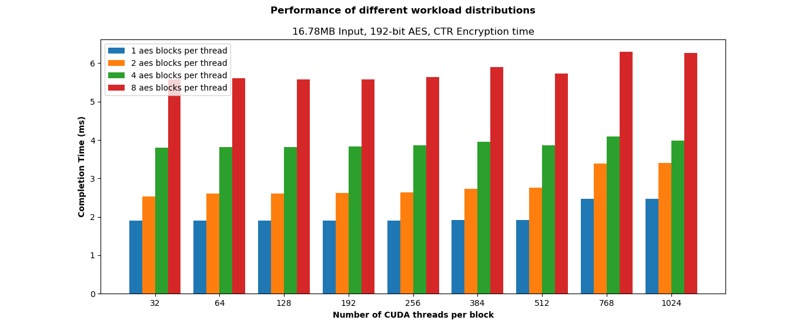

The first thing we see is a lot of inefficiency for having one thread handle more than one AES block. While this may seem strange, there is some sense in having each kernel do less overall work; when they are able to run for less time, and require access to less overall data, they apparently don't step on each others' toes as much. I imagine the context switching with longer kernel executions led to some degree of these issues.

As for the block size itself, the only substantive differences we see are some increases in execution times across the larger number of blocks. This again speaks to the sense in having more nimble chunks of executable units available to our scheduler.

## References

* CPU baseline implementation and key expansion implementation taken from kokke's [tiny-AES-c](https://github.com/kokke/tiny-AES-c.git) implementation
* Command-line parsing using [cxxopts](https://github.com/jarro2783/cxxopts)
* [CUDA Application Design and Development](http://www.hds.bme.hu/~fhegedus/C++/CUDA_Application_Design.pdf) (pdf link) by Rob Farber
